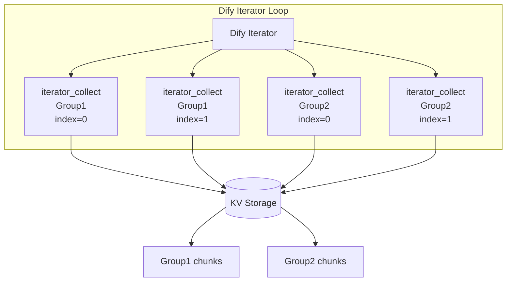
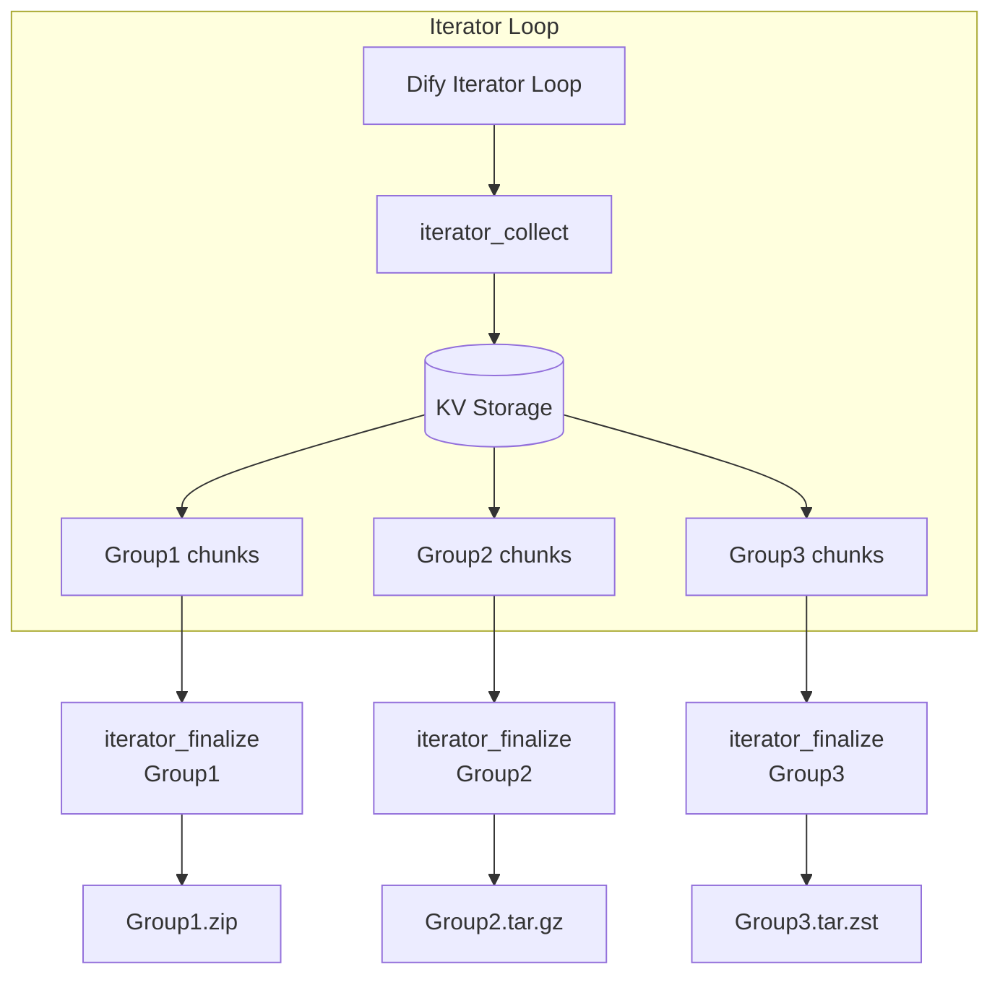

# Define Archiver

English | [Japanese](README.ja.md) | [Simplified Chinese](README.zh-Hans.md) | [Traditional Chinese](README.zh-Hant.md)

A Dify Plugin for creating, managing, and inspecting archives optimized for AI workflow automation.

## Overview

define_archiver is a Dify plugin that provides archive creation and inspection capabilities for large-scale AI workflows.

It is designed for scenarios where large text data, documents, or generated content must be processed through Dify workflows while avoiding variable size limitations.

The plugin supports:

* Iterator-based distributed archive generation
* Large text collection through KV storage
* Internal Zstandard compression
* Group-based multiple archive generation
* Archive content inspection and file listing without extraction

---

# Tools

## archive

### Overview

`archive` is a basic archive creation tool that converts one or more input data objects into a specified archive format.

It is intended for standard workflow operations where processed text, documents, or generated data need to be packaged into a downloadable archive.

### Use Cases

* Compressing small or medium-sized file collections
* Saving LLM-generated results
* Packaging workflow outputs
* Creating temporary data archives

### Features

* Supports multiple files in a single archive
* Preserves file path information
* Supports multiple archive formats:

  * ZIP
  * TAR.GZ
  * TAR.ZST
* Configurable compression levels

---

## archive_inspect

### Overview

`archive_inspect` is an analysis tool that retrieves the internal file paths of an archive without extracting its contents.

It provides a fast way to inspect archive structures and returns the result as a JSON array.

### Use Cases

* Checking archive contents
* Validating generated archives
* Performing workflow branching based on archive structure
* Inspecting large archives before extraction

### Features

* Reads archive metadata without extracting files
* Supports:

  * ZIP
  * TAR.GZ
  * TAR.ZST
* Removes directory entries and returns only file paths
* Outputs JSON format for use with LLM nodes and code nodes

### Example Output

```json
[
  "book/chapter01.txt",
  "book/chapter02.txt",
  "metadata.json"
]
```

---

## iterator_collect

### Overview

`iterator_collect` is a data collection tool designed to be executed inside Dify Iterator loops.

It receives incremental data chunks from each loop iteration and temporarily stores them securely in the internal Key-Value (KV) storage, optimized with Zstandard compression.

Each archive group is identified by a Group ID (`collect_group_id`). Multiple chunks belonging to the same Group ID are collected and later processed by a corresponding `iterator_finalize` execution.

Each Group ID must be unique within the same workflow execution. Using the same Group ID for unrelated data combines them into the same archive.

### Use Cases

* Collecting incremental text or documents generated inside a loop
* Gathering distributed outputs from parallel or sequential executions
* Staging large data chunks without overwhelming workflow variable limits

### Inputs (Parameters)

| Parameter Name | Type | Required | Description |
| :--- | :--- | :---: | :--- |
| `collect_group_id` | String | **Yes** | The group identifier used to separate collected data within the same workflow execution. Data with the same ID is combined into one archive. |
| `iterator_index` | Number | **Yes** | The current loop index value provided by the Dify iterator. |
| `content` | String | **Yes** | The actual text or document data to be compressed and archived. |
| `workflow_run_id` | String | **Yes** | System run ID. Defaults to `{{#sys.workflow_run_id#}}` to isolate and protect data from other workflow executions. |

### Features

* **Multi-Group Isolation:** Supports multiple executions inside Dify Iterator separated by `collect_group_id`.
* **Concurrent Collection:** Supports parallel iterator execution with synchronization control.
* **Efficient Staging:** Uses Zstandard compression for temporary KV storage to minimize memory footprint.
* **Workflow Isolation:** Uses workflow_run_id to isolate collected data between workflow executions.

### Processing Flow



---

## iterator_finalize

### Overview

`iterator_finalize` is a finalization tool that processes data collected by `iterator_collect` and generates the final archive output for a specific Group ID.

For workflows containing multiple archive groups, each Group ID requires its own corresponding `iterator_finalize` node execution to output its distinct archive.

### Use Cases

* Compiling collected loop outputs for a specific Group ID (`collect_group_id`) into a structured archive.
* Generating distinct archives for each Group ID, such as a project, document set, or content category.
* Cleaning up temporary KV storage data after archiving is complete.

### Inputs (Parameters)

| Parameter Name | Type | Required | Default | Description |
| :--- | :--- | :---: | :---: | :--- |
| `collect_group_id` | String | **Yes** | - | Group ID used to determine which data is compressed into the same archive. All data with the same group ID will be compressed into a single archive. |
| `content_folder` | String | **Yes** | - | Folder path(s) inside the generated archive. A single path applies to all files; comma-separated paths specify folders for each file in order (e.g., `category1/book1` or `book1,book2`). Do not include filenames. |
| `content_prefix` | String | **Yes** | `part_` | The prefix used for automatically generated filenames. The iterator index is used to generate sequential filenames. |
| `index_padding_width` | Number | **Yes** | `3` | Number of digits used to zero-pad sequential index numbers in generated filenames (e.g., `3` → `001`, `002`, `003`). |
| `content_extension` | String | **Yes** | `txt` | The file extension for generated archive entries (without leading dot). When decode_base64 is enabled, detected image extensions override this value. |
| `decode_base64` | Boolean | **Yes** | `false` | Set to `true` when the input content may contain Base64-encoded data. The tool uses regular expressions to detect and extract Base64 data embedded in the text. If you want to keep Base64 strings unchanged within the source text, set this to `false` (OFF). Image formats are automatically detected when possible. |
| `format` | Select | **Yes** | `zip` | Output archive format. Options: `zip` (maximum compatibility), `tar.gz` (Unix systems), `tar.zst` (high-speed compression for large datasets). |
| `compression` | Select | **Yes** | `normal` | Compression level balance. Options: `store` (disables compression), `fast`, `normal`, `best` (smallest archive size). |
| `include_manifest` | Boolean | **Yes** | `true` | Set to `true` to automatically generate and embed a metadata `manifest.json` in the archive root directory. |
| `workflow_run_id` | String | **Yes** | `{{#sys.workflow_run_id#}}` | System run ID used to isolate and protect data from other workflow executions. |

### Outputs

| Property Name | Type | Description |
| :--- | :--- | :--- |
| `archives` | Array(File) | The generated archive file(s) for the specified Group ID. |

### Features

* **Sequential Auto-Naming:** Automatically generates structured filenames inside the archive using the iterator index, prefixes, and zero-padding (e.g., `part_001.txt`).
* **Base64 Asset Restoration:** Seamlessly converts Base64 text back into binary assets while auto-detecting image extensions like PNG or JPEG.
* **Metadata Attachment:** Generates an optional `manifest.json` in the archive root for immediate downstream tracing or indexing.
* **Automatic Storage Cleanup:** Cleans up temporary KV storage allocations immediately after a successful export to optimize workspace resources.
* **Workflow Isolation:** Uses workflow_run_id to isolate collected data between workflow executions.

### Processing Flow



### Difference from archive

`archive` is designed for one-time archive creation from already available data in a single node execution.

The `iterator_collect` and `iterator_finalize` combination is designed for large-scale workflows where data is generated incrementally through loop iterations and collected efficiently by Group ID before packaging into final archives.

---

# Author

schnee-and-tetra ([308144300+schnee-and-tetra@users.noreply.github.com](mailto:308144300+schnee-and-tetra@users.noreply.github.com))

# Setup

Install Define Archiver by importing the `.difypkg` package into Dify or installing it from Dify Plugin Marketplace.

No external API keys, credentials, or service connections are required.

# Usage

Define Archiver provides archive-related tools for Dify workflows:

* Create archives from text or document data.
* Inspect archive contents without extraction.
* Collect incremental data inside Dify Iterator workflows.
* Generate final archives from collected iterator data.

# Requirements

* Dify Community Edition or Dify Cloud
* No external API access required
* No additional credentials required

# Source Repository

https://github.com/schnee-and-tetra/define_archiver

# License

Apache License 2.0
