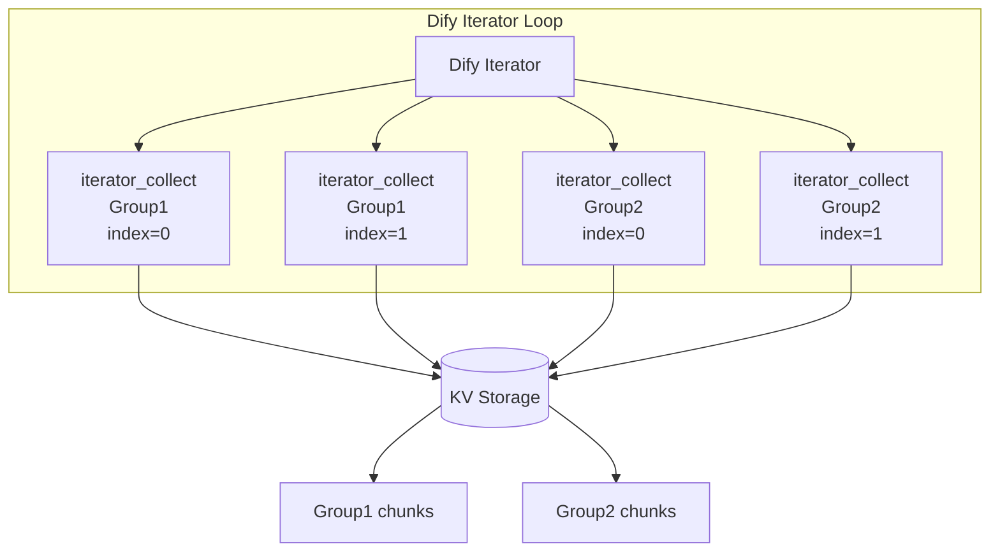
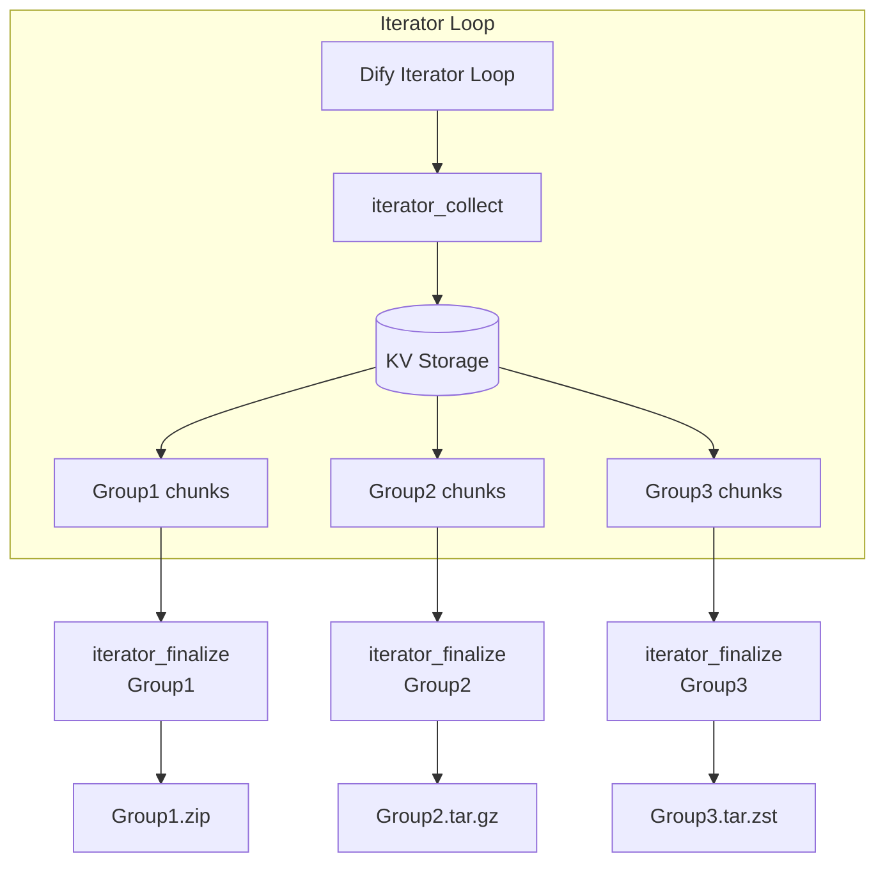

# Define Archiver

[English](README.md) | [日本語](README.ja.md) | 简体中文 | [繁體中文](README.zh-Hant.md)

一个针对 AI 工作流自动化优化的 Dify 插件，用于创建、管理和检查归档文件。

## 概述

define_archiver 是一个 Dify 插件，为大规模 AI 工作流提供归档创建与内容检查功能。

它专为需要在 Dify 工作流中处理大量文本数据、文档或生成内容，同时避免变量体积限制（上下文限制）的场景而设计。

本插件支持：

* 基于迭代器（Iterator）的分布式归档生成
* 基于 KV 存储的大容量文本收集
* 内置 Zstandard 压缩
* 按组生成多个归档文件
* 无需解压即可检查归档内容和文件列表

---

# 工具

## archive

### 概述

`archive` 是一个基础归档工具，可将一个或多个输入数据对象转换为指定的归档格式。

适用于将处理后的文本、文档或生成数据打包为可下载归档文件的常规工作流场景。

### 使用场景

* 压缩中小型文件集合
* 保存 LLM 生成结果
* 打包工作流输出
* 创建临时数据归档

### 特性

* 支持在一个归档中包含多个文件
* 保留文件路径信息
* 支持以下归档格式：

  * ZIP
  * TAR.GZ
  * TAR.ZST
* 可配置压缩等级

---

## archive_inspect

### 概要

`archive_inspect` 是一个分析工具，可在不解压归档内容的情况下获取归档内部文件路径。

它能够快速检查归档结构，并以 JSON 数组形式返回结果。

### 使用场景

* 检查归档内容
* 验证生成的归档文件
* 根据归档结构进行工作流分支
* 在解压前检查大型归档

### 特性

* 无需解压即可读取归档元数据
* 支持以下格式：

  * ZIP
  * TAR.GZ
  * TAR.ZST
* 自动过滤目录项，仅返回文件路径
* 输出 JSON 格式，便于 LLM 节点和代码节点使用

### 输出示例

```json
[
  "book/chapter01.txt",
  "book/chapter02.txt",
  "metadata.json"
]
```

---

## iterator_collect

### 概述

`iterator_collect` 是一个专为 Dify 迭代器（Iterator）循环内执行而设计的数据收集工具。

它接收每次循环迭代产生的数据块（Chunk），并使用经过 Zstandard 压缩优化的内部 Key-Value（KV）存储进行安全的临时保存。

每个归档组都通过 Group ID（`collect_group_id`）进行标识。属于同一 Group ID 的多个数据块会被逐步蓄积，并由对应的 `iterator_finalize` 在后续进行一括处理。

在同一次工作流执行中，每个 Group ID 必须保持唯一。如果对无关数据使用相同的 Group ID，它们将被合并到同一个归档中。

### 使用场景

* 收集循环中逐步生成的文本或文档
* 汇总并行或顺序执行产生的分布式输出
* 临时保存大数据块，避免超过工作流变量体积限制（上下文限制）

### 输入（参数）

| 参数名称               | 类型     |   必填  | 说明                                                          |
| :----------------- | :----- | :---: | :---------------------------------------------------------- |
| `collect_group_id` | String | **是** | 用于在同一次工作流执行中区分收集数据的组标识符。具有相同 ID 的数据会被合并到同一个归档中。             |
| `iterator_index`   | Number | **是** | Dify 迭代器（Iterator）提供的当前循环索引值。                                   |
| `content`          | String | **是** | 实际需要压缩并归档的文本或文档数据。                                          |
| `workflow_run_id`  | String | **是** | 系统运行 ID。默认值为 `{{#sys.workflow_run_id#}}`，用于与其他工作流执行隔离并保护数据。 |

### 特性

* **多组隔离：** 支持通过 `collect_group_id` 在同一个 Dify 迭代器中同时处理多个独立组。
* **并发收集：** 通过排他与同步控制，支持迭代器多线程并行执行时的安全数据收集。
* **高效暂存：** 使用 Zstandard 压缩存储到 KV 中，最大限度减少内存与存储空间占用。
* **工作流隔离：** 使用 `workflow_run_id` 将不同工作流执行的数据彼此安全隔离。

### 处理流程



---

## iterator_finalize

### 概述

`iterator_finalize` 是一个用于处理 `iterator_collect` 收集的数据、并生成指定 Group ID 最终归档文件的收尾工具。

对于包含多个归档组的工作流，每个 Group ID 都需要对应执行一个 `iterator_finalize` 节点，以分别输出各自独立的归档文件。

### 使用场景

* 将指定 Group ID（`collect_group_id`）收集到的循环输出整理为结构化归档。
* 为不同 Group ID（如项目、文档集或内容分类）分别生成独立归档。
* 在归档完成后自动清理临时 KV 存储数据。

### 输入（参数）

| 参数名称                  | 类型      |   必填  |             默认值             | 说明                                                                                                  |
| :-------------------- | :------ | :---: | :-------------------------: | :-------------------------------------------------------------------------------------------------- |
| `collect_group_id`    | String  | **是** |              -              | 用于决定哪些数据压缩到同一个归档中的 Group ID。具有相同 Group ID 的所有数据都会压缩到同一个归档中。                                         |
| `content_folder`      | String  | **是** |              -              | 生成归档中的文件夹路径。指定单一路径时应用于所有文件；使用逗号分隔多个路径时，将按顺序分别应用到各个文件（例如：`category1/book1` 或 `book1,book2`）。不要包含文件名。 |
| `content_prefix`      | String  | **是** |           `part_`           | 自动生成文件名时使用的前缀。文件名会根据迭代器（Iterator）索引生成连续编号。                                                             |
| `index_padding_width` | Number  | **是** |             `3`             | 自动生成文件名时序号的零填充位数（例如：`3` → `001`、`002`、`003`）。                                                       |
| `content_extension`   | String  | **是** |            `txt`            | 归档中文件的扩展名（不包含前导点）。启用 `decode_base64` 时，自动检测到的图片扩展名将优先于此设置。                                              |
| `decode_base64`       | Boolean | **是** |           `false`           | 当输入内容为 Base64 编码数据时，请设置为 `true`。工具会尽可能自动识别图片格式。由于工具会通过正则表达式在文本中自动识别并提取 Base64 数据，如果您希望在原始文本中保留 Base64 字符串，请将其设置为 `false`（OFF）。 尽可能自动识别图片格式。                            |
| `format`              | Select  | **是** |            `zip`            | 输出归档格式。可选值：`zip`（兼容性最佳）、`tar.gz`（Unix 系统）、`tar.zst`（适用于大型数据集的高速压缩）。                                 |
| `compression`         | Select  | **是** |           `normal`          | 压缩级别。可选值：`store`（不压缩）、`fast`、`normal`、`best`（最小归档体积）。                                               |
| `include_manifest`    | Boolean | **是** |            `true`           | 设置为 `true` 时，会自动在归档根目录生成并嵌入元数据文件 `manifest.json`。                                                   |
| `workflow_run_id`     | String  | **是** | `{{#sys.workflow_run_id#}}` | 系统运行 ID，用于隔离并保护不同工作流执行的数据。                                                                          |

### 输出

| 属性名称       | 类型          | 说明                    |
| :--------- | :---------- | :-------------------- |
| `archives` | Array (File) | 为指定 Group ID 生成的归档文件。 |

### 特性

* **自动连续命名：** 根据迭代器（Iterator）索引、前缀及零填充设置，自动生成结构化文件名（例如 `part_001.txt`）。
* **Base64 文件恢复：** 可将 Base64 文本恢复为二进制文件，并自动识别 PNG、JPEG 等图片扩展名。
* **元数据附加：** 可选择在归档根目录生成 `manifest.json`，方便后续追踪和索引。
* **自动清理存储：** 成功导出后立即清理临时 KV 存储，以优化系统资源（节约存储空间）。
* **工作流隔离：** 使用 `workflow_run_id` 将不同工作流执行的数据彼此安全隔离。

### 处理流程



### 与 archive 的区别

`archive` 用于在单次节点执行中，对已经准备好的数据一次性生成归档文件。

而 `iterator_collect` 与 `iterator_finalize` 的组合则面向大规模工作流设计，能够按 Group ID 高效收集循环（迭代器）中逐步生成的数据，并最终打包生成归档文件。

---

# 作者

schnee-and-tetra ([308144300+schnee-and-tetra@users.noreply.github.com](mailto:308144300+schnee-and-tetra@users.noreply.github.com))

# 安装

Define Archiver 可以通过将 `.difypkg` 软件包导入 Dify 来安装，也可以通过 Dify Plugin Marketplace 进行安装。

不需要外部 API 密钥、认证信息或外部服务连接。

# 使用方法

Define Archiver 为 Dify 工作流提供与归档相关的工具。

可用工具：

* `archive`
  * 从文本或文档数据创建归档文件。

* `archive_inspect`
  * 无需解压即可检查归档内容。

* `iterator_collect`
  * 在 Dify Iterator 工作流中收集分段数据。

* `iterator_finalize`
  * 根据收集的 Iterator 数据生成最终归档文件。

# 要求

* Dify Community Edition 或 Dify Cloud
* 无需外部 API 访问
* 无需额外认证信息

# 源代码仓库

https://github.com/schnee-and-tetra/define_archiver

# 许可证

Apache License 2.0
