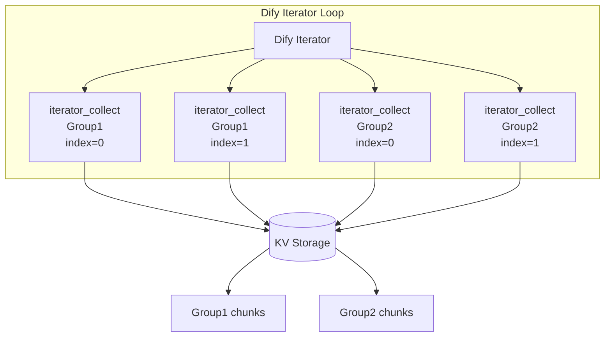
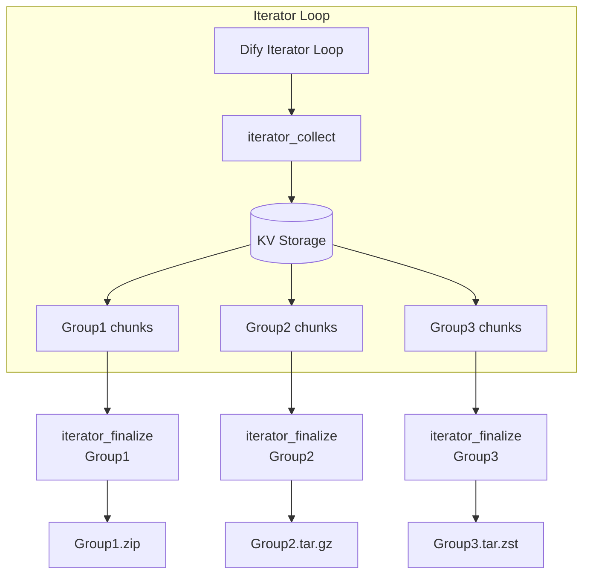

# Define Archiver

[English](README.md) | 日本語 | [简体中文](README_zh-Hans.md) | [繁體中文](README_zh-Hant.md)

AIワークフロー自動化向けに最適化された、アーカイブの作成・管理・内容確認を行う Dify プラグインです。

## 概要

define_archiver は、大規模な AI ワークフロー向けにアーカイブの作成および内容確認機能を提供する Dify プラグインです。

大量のテキストデータ、ドキュメント、または生成コンテンツを、Difyのシステム変数サイズ制限（コンテキスト制限）を回避しながらワークフローで処理するために設計されています。

本プラグインは以下の機能を提供します。

* イテレータ（Iterator）ベースの分散アーカイブ生成
* KV ストレージを利用した大容量テキストの収集
* 内部 Zstandard 圧縮
* グループ単位での複数アーカイブ生成
* 展開せずにアーカイブ内容やファイル一覧を確認

---

# ツール

## archive

### 概要

`archive` は、1 つ以上の入力データを指定したアーカイブ形式へ変換する基本的なアーカイブ作成ツールです。

処理済みテキスト、ドキュメント、生成データなどをダウンロード可能なアーカイブとしてまとめる、一般的なワークフロー用途を想定しています。

### 使用例

* 小規模～中規模のファイル群の圧縮
* LLM が生成した結果の保存
* ワークフロー出力のパッケージ化
* 一時データのアーカイブ作成

### 特徴

* 複数ファイルを 1 つのアーカイブへ格納可能
* ファイルパス情報を保持
* 以下のアーカイブ形式に対応

  * ZIP
  * TAR.GZ
  * TAR.ZST
* 圧縮レベルを設定可能

---

## archive_inspect

### 概要

`archive_inspect` は、アーカイブを展開することなく内部のファイルパス一覧を取得する解析ツールです。

アーカイブ構造を高速に確認し、結果を JSON 配列として返します。

### 使用例

* アーカイブ内容の確認
* 生成されたアーカイブの検証
* アーカイブ構造に応じたワークフロー分岐
* 展開前の大容量アーカイブの内容確認

### 特徴

* ファイルを展開せずにアーカイブのメタデータを読み取り
* 以下の形式に対応

  * ZIP
  * TAR.GZ
  * TAR.ZST
* ディレクトリエントリを除外し、ファイルパスのみを返却
* LLM ノードおよびコードノードで利用しやすい JSON 形式で出力

### 出力例

```json
[
  "book/chapter01.txt",
  "book/chapter02.txt",
  "metadata.json"
]
```

---

## iterator_collect

### 概要

`iterator_collect` は、Dify のイテレータ（Iterator）ループ内で実行するために設計されたデータ収集ツールです。

各ループの反復処理（インデックス）から渡されるデータチャンクを受け取り、Zstandard 圧縮を用いて最適化された内部 Key-Value（KV）ストレージへ安全に一時保存します。

各アーカイブグループは Group ID（`collect_group_id`）によって識別されます。同じ Group ID に属する複数のチャンクは蓄積され、対応する `iterator_finalize` によって後から一括処理されます。

同一ワークフロー実行内では、各 Group ID は一意である必要があります。関連しないデータに同じ Group ID を使用すると、それらは同一アーカイブへまとめられます。

### 使用例

* ループ内で生成されるテキストやドキュメントの収集
* 並列または順次実行された分散出力の収集
* ワークフローの変数サイズ制限を超えないよう、大容量データを一時保存

### 入力（パラメーター）

| パラメーター名            | 型      |   必須   | 説明                                                                     |
| :----------------- | :----- | :----: | :--------------------------------------------------------------------- |
| `collect_group_id` | String | **はい** | 同一ワークフロー実行内で収集データを分類するためのグループ識別子です。同じ ID のデータは 1 つのアーカイブへまとめられます。      |
| `iterator_index`   | Number | **はい** | Dify イテレータ（Iterator）が提供する現在のループインデックスです。                                     |
| `content`          | String | **はい** | 圧縮・アーカイブ対象となる実際のテキストまたはドキュメントデータです。                                    |
| `workflow_run_id`  | String | **はい** | システム実行 ID。既定値は `{{#sys.workflow_run_id#}}` で、他のワークフロー実行からデータを分離・保護します。 |

### 特徴

* **マルチグループ分離:** `collect_group_id` により、１回のDifyイテレータ実行内で複数グループを同時に扱えます。
* **並列収集対応:** 同期制御により、イテレータの並列実行にも対応します。
* **効率的な一時保存:** Zstandard 圧縮を利用して KV ストレージへの一時保存時のメモリ使用量を最小化します。
* **ワークフロー分離:** `workflow_run_id` により、ワークフロー実行ごとに収集データを分離します。

### 処理フロー



---

## iterator_finalize

### 概要

`iterator_finalize` は、`iterator_collect` によって収集されたデータを処理し、指定した Group ID の最終アーカイブを生成する仕上げツールです。

複数のアーカイブグループを含むワークフローでは、それぞれの Group ID ごとに対応する `iterator_finalize` ノードを実行し、それぞれ独立したアーカイブを出力します。

### 使用例

* 特定の Group ID（`collect_group_id`）に収集されたループ出力を構造化されたアーカイブへまとめる
* プロジェクト、ドキュメントセット、コンテンツカテゴリなど、Group ID ごとに個別のアーカイブを生成する
* アーカイブ生成後に一時 KV ストレージをクリーンアップする

### 入力（パラメーター）

| パラメーター名               | 型       |   必須   |             既定値             | 説明                                                                                                                            |
| :-------------------- | :------ | :----: | :-------------------------: | :---------------------------------------------------------------------------------------------------------------------------- |
| `collect_group_id`    | String  | **はい** |              -              | 同一アーカイブへ圧縮するデータを判別するための Group ID です。同じ Group ID のデータは 1 つのアーカイブへまとめられます。                                                      |
| `content_folder`      | String  | **はい** |              -              | 生成されるアーカイブ内のフォルダパスです。単一パスを指定すると全ファイルに適用され、カンマ区切りで指定すると各ファイルへ順番に適用されます（例：`category1/book1` または `book1,book2`）。ファイル名は含めないでください。 |
| `content_prefix`      | String  | **はい** |           `part_`           | 自動生成されるファイル名に付与するプレフィックスです。イテレータインデックスを利用して連番ファイル名を生成します。                                                                 |
| `index_padding_width` | Number  | **はい** |             `3`             | 連番インデックスをゼロ埋めする桁数です（例：`3` → `001`、`002`、`003`）。                                                                               |
| `content_extension`   | String  | **はい** |            `txt`            | アーカイブ内に格納されるファイルの拡張子です（先頭のドットは不要）。`decode_base64` が有効な場合は、自動検出された画像拡張子がこの値より優先されます。                                                |
| `decode_base64`       | Boolean | **はい** |           `false`           | 入力コンテンツにBase64エンコードされたデータが含まれる可能性がある場合は、`true`に設定してください。このツールは正規表現を使用して、テキストに埋め込まれたBase64データを検出し、抽出します。ソーステキスト内のBase64文字列をそのまま保持したい場合は、`false`（OFF）に設定してください。画像形式は、可能な場合は自動的に検出されます。   |
| `format`              | Select  | **はい** |            `zip`            | 出力アーカイブ形式です。選択肢：`zip`（最大互換性）、`tar.gz`（Unix 系向け）、`tar.zst`（大容量データ向け高速圧縮）。                                                      |
| `compression`         | Select  | **はい** |           `normal`          | 圧縮レベルです。選択肢：`store`（圧縮しない）、`fast`、`normal`、`best`（最小サイズ）。                                                                     |
| `include_manifest`    | Boolean | **はい** |            `true`           | `true` にすると、アーカイブのルートディレクトリへメタデータ `manifest.json` を自動生成して埋め込みます。                                                              |
| `workflow_run_id`     | String  | **はい** | `{{#sys.workflow_run_id#}}` | 他のワークフロー実行からデータを分離・保護するためのシステム実行 ID です。                                                                                       |

### 出力

| プロパティ名     | 型           | 説明                                  |
| :--------- | :---------- | :---------------------------------- |
| `archives` | Array (File) | 指定した Group ID に対して生成されたアーカイブファイルです。 |

### 特徴

* **連番ファイル名の自動生成:** イテレータインデックス、プレフィックス、ゼロ埋め設定を利用して、`part_001.txt` のような構造化されたファイル名を自動生成します。
* **Base64 ファイル復元:** Base64 テキストをバイナリファイルへ復元し、PNG や JPEG などの画像拡張子も自動判別します。
* **メタデータ添付:** 必要に応じてアーカイブのルートへ `manifest.json` を生成し、後続処理での追跡やインデックス作成を容易にします。
* **ストレージ自動クリーンアップ:** エクスポート成功後、一時 KV ストレージを即座に削除し、システムリソース（ストレージ容量）を最適化します。
* **ワークフロー分離:** `workflow_run_id` を利用してワークフロー実行ごとに収集データを分離します。

### 処理フロー



### archive との違い

`archive` は、単一ノードの実行時に、すでに利用可能なデータから一度だけアーカイブを生成するためのツールです。

一方、`iterator_collect` と `iterator_finalize` の組み合わせは、ループ（イテレータ）処理で段階的に生成される大量データを Group ID ごとに効率よく収集し、最終的なアーカイブへまとめる大規模ワークフロー向けに設計されています。
---

# 作者

schnee_and_tetra ([308144300+schnee-tetra@users.noreply.github.com](mailto:308144300+schnee-tetra@users.noreply.github.com))

# ライセンス

Apache License 2.0
