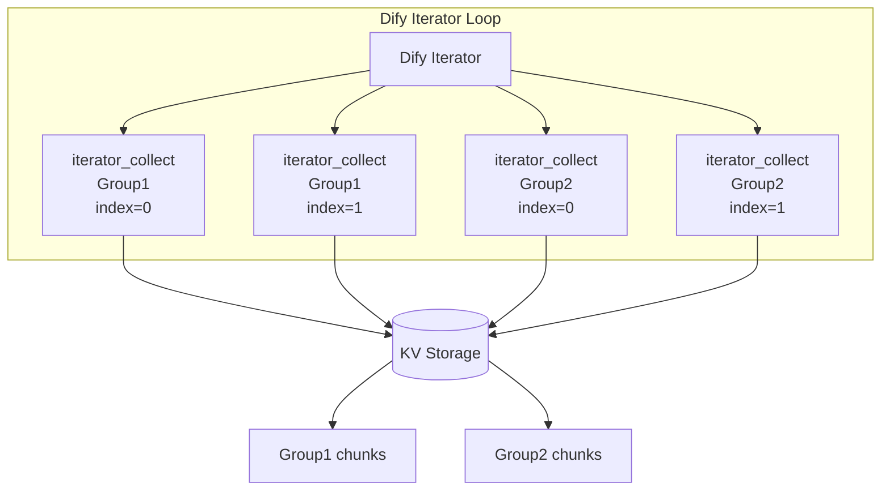
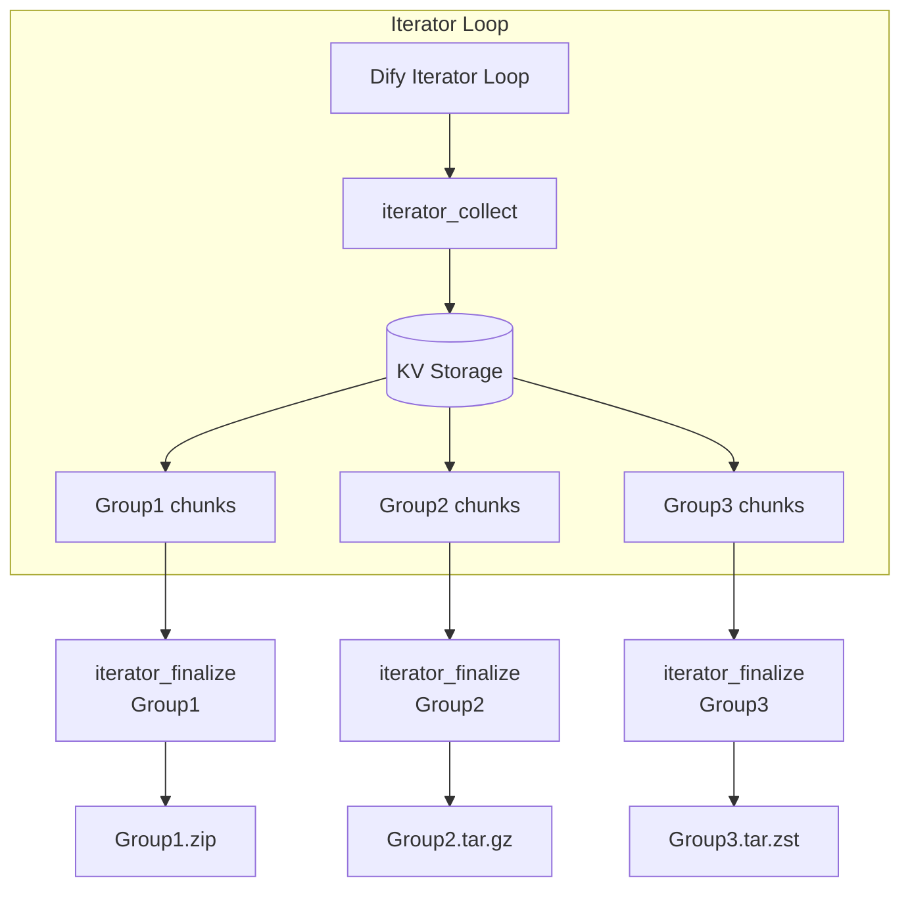

# Define Archiver

[English](README.md) | [日本語](README_ja.md) | [简体中文](README_zh-Hans.md) | 繁體中文

一個針對 AI 工作流程自動化最佳化的 Dify 外掛，用於建立、管理與檢查封存檔。

## 概述

define_archiver 是一個 Dify 外掛，提供適用於大型 AI 工作流程的封存建立與內容檢查功能。

它專為需要在 Dify 工作流程中處理大量文字資料、文件或生成內容，同時避免變數容量限制（本文長度限制）的情境而設計。

本外掛支援：

* 基於反覆器（Iterator）的分散式封存產生
* 透過 KV 儲存的大容量文字收集
* 內建 Zstandard 壓縮
* 依群組產生多個封存檔
* 無需解壓即可檢查封存內容與檔案清單

---

# 工具

## archive

### 概述

`archive` 是一個基本的封存建立工具，可將一個或多個輸入資料物件轉換為指定的封存格式。

適用於將已處理的文字、文件或生成資料封裝成可下載封存檔的一般工作流程。

### 使用情境

* 壓縮中小型檔案集合
* 儲存 LLM 產生的結果
* 封裝工作流程輸出
* 建立暫時性資料封存

### 特性

* 支援在單一封存中包含多個檔案
* 保留檔案路徑資訊
* 支援以下封存格式：

  * ZIP
  * TAR.GZ
  * TAR.ZST
* 可設定壓縮等級

---

## archive_inspect

### 概述

`archive_inspect` 是一個分析工具，可在不解壓封存內容的情況下取得封存內部的檔案路徑。

它能快速檢查封存結構，並以 JSON 陣列形式回傳結果。

### 使用情境

* 檢查封存內容
* 驗證已產生的封存檔
* 根據封存結構執行工作流程分支
* 在解壓前檢查大型封存檔

### 特性

* 無需解壓即可讀取封存中繼資料
* 支援以下格式：

  * ZIP
  * TAR.GZ
  * TAR.ZST
* 自動過濾目錄項目，僅回傳檔案路徑
* 以 JSON 格式輸出，便於 LLM 節點與程式碼節點使用

### 輸出範例

```json
[
  "book/chapter01.txt",
  "book/chapter02.txt",
  "metadata.json"
]
```

---

## iterator_collect

### 概述

`iterator_collect` 是一個專為 Dify 反覆器（Iterator）迴圈內執行所設計的資料收集工具。

它會接收每次迴圈迭代產生的資料區塊（Chunk），並透過經過 Zstandard 壓縮最佳化的內部 Key-Value（KV）儲存進行安全的暫時保存。

每個封存群組皆以 Group ID（`collect_group_id`）識別。屬於相同 Group ID 的多個資料區塊會被逐步累積，並由對應的 `iterator_finalize` 在後續進行一併處理。

在同一次工作流程執行中，每個 Group ID 都必須保持唯一。若對無關資料使用相同的 Group ID，它們將被合併至同一個封存檔中。

### 使用情境

* 收集迴圈中逐步產生的文字或文件
* 彙整平行（Parallel）或循序執行所產生的分散式輸出
* 暫存大型資料區塊，避免超過工作流程變數容量限制（本文長度限制）

### 輸入（參數）

| 參數名稱               | 類型     |   必填  | 說明                                                           |
| :----------------- | :----- | :---: | :----------------------------------------------------------- |
| `collect_group_id` | String | **是** | 用於在同一次工作流程執行中區分收集資料的群組識別碼。具有相同 ID 的資料將合併為同一個封存檔。             |
| `iterator_index`   | Number | **是** | Dify 反覆器（Iterator）提供的目前迴圈索引值。                                    |
| `content`          | String | **是** | 實際需要壓縮並封存的文字或文件資料。                                           |
| `workflow_run_id`  | String | **是** | 系統執行 ID。預設值為 `{{#sys.workflow_run_id#}}`，用於隔離並保護不同工作流程執行的資料。 |

### 特性

* **多群組隔離：** 透過 `collect_group_id` 支援在同一個 Dify 反覆器中同時處理多個獨立群組。
* **並行收集：** 透過互斥與同步控制，支援反覆器多執行緒平行執行時的安全資料收集。
* **高效率暫存：** 使用 Zstandard 壓縮將資料暫存至 KV 儲存，最大限度減少記憶體與儲存空間占用。
* **工作流程隔離：** 使用 `workflow_run_id` 將不同工作流程執行所收集的資料彼此安全隔離。

### 處理流程



---

## iterator_finalize

### 概述

`iterator_finalize` 是一個用於處理 `iterator_collect` 所收集的資料，並產生指定 Group ID 最終封存檔的收尾工具。

對於包含多個封存群組的工作流程，每個 Group ID 都需要對應執行一個 `iterator_finalize` 節點，以分別輸出各自獨立的封存檔。

### 使用情境

* 將指定 Group ID（`collect_group_id`）所收集的迴圈輸出整理成結構化封存。
* 為不同 Group ID（例如專案、文件集合或內容分類）產生獨立封存檔。
* 在封存完成後自動清理暫時性的 KV 儲存資料。

### 輸入（參數）

| 參數名稱                  | 類型      |   必填  |             預設值             | 說明                                                                                                |
| :-------------------- | :------ | :---: | :-------------------------: | :------------------------------------------------------------------------------------------------ |
| `collect_group_id`    | String  | **是** |              -              | 用於決定哪些資料會壓縮至同一封存檔的 Group ID。具有相同 Group ID 的所有資料都會壓縮成一個封存檔。                                        |
| `content_folder`      | String  | **是** |              -              | 產生之封存內的資料夾路徑。指定單一路徑時會套用至所有檔案；使用逗號分隔多個路徑時，將依序套用至各個檔案（例如：`category1/book1` 或 `book1,book2`）。請勿包含檔名。 |
| `content_prefix`      | String  | **是** |           `part_`           | 自動產生檔名時使用的前綴。檔名會依據反覆器（Iterator）索引產生連續編號。                                                             |
| `index_padding_width` | Number  | **是** |             `3`             | 自動產生檔名時序號的補零位數（例如：`3` → `001`、`002`、`003`）。                                                       |
| `content_extension`   | String  | **是** |            `txt`            | 封存內檔案的副檔名（不包含前導句點）。當啟用 `decode_base64` 時，自動偵測到的圖片副檔名將優先於此設定。                                          |
| `decode_base64`       | Boolean | **是** |           `false`           | 當輸入內容為 Base64 編碼資料時，請設為 `true`。由於工具會透過正規表達式在文字中自動辨識並擷取 Base64 資料，若您希望在原始文字中保留 Base64 字串，請將其設為 `false`（OFF）。 會盡可能自動辨識圖片格式。                           |
| `format`              | Select  | **是** |            `zip`            | 輸出封存格式。可選值：`zip`（最佳相容性）、`tar.gz`（Unix 系統）、`tar.zst`（適合大型資料集的高速壓縮）。                                |
| `compression`         | Select  | **是** |           `normal`          | 壓縮等級。可選值：`store`（不壓縮）、`fast`、`normal`、`best`（最小封存大小）。                                             |
| `include_manifest`    | Boolean | **是** |            `true`           | 設為 `true` 時，會自動在封存根目錄產生並嵌入中繼資料 `manifest.json`。                                                   |
| `workflow_run_id`     | String  | **是** | `{{#sys.workflow_run_id#}}` | 用於隔離並保護不同工作流程執行資料的系統執行 ID。                                                                        |

### 輸出

| 屬性名稱       | 類型          | 說明                    |
| :--------- | :---------- | :-------------------- |
| `archives` | Array (File) | 為指定 Group ID 所產生的封存檔。 |

### 特性

* **自動連續命名：** 根據反覆器（Iterator）索引、前綴與補零設定，自動產生如 `part_001.txt` 的結構化檔名。
* **Base64 檔案還原：** 可將 Base64 文字還原為二進位檔案，並自動辨識 PNG、JPEG 等圖片副檔名。
* **附加中繼資料：** 可選擇在封存根目錄產生 `manifest.json`，方便後續追蹤與建立索引。
* **自動清理儲存空間：** 成功匯出後立即清除暫時性的 KV 儲存，以最佳化系統資源（節省儲存空間）。
* **工作流程隔離：** 使用 `workflow_run_id` 將不同工作流程執行所收集的資料彼此安全隔離。

### 處理流程



### 與 archive 的差異

`archive` 用於在單次節點執行中，針對已準備好的資料一次性建立封存檔。

而 `iterator_collect` 與 `iterator_finalize` 的組合則是專為大型工作流程設計，能依照 Group ID 高效率收集迴圈（反覆器）中逐步產生的資料，最後再封裝成最終封存檔。

---

# 作者

schnee_and_tetra ([308144300+schnee-tetra@users.noreply.github.com](mailto:308144300+schnee-tetra@users.noreply.github.com))

# 授權條款

Apache License 2.0
